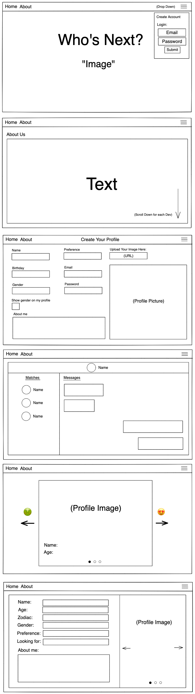
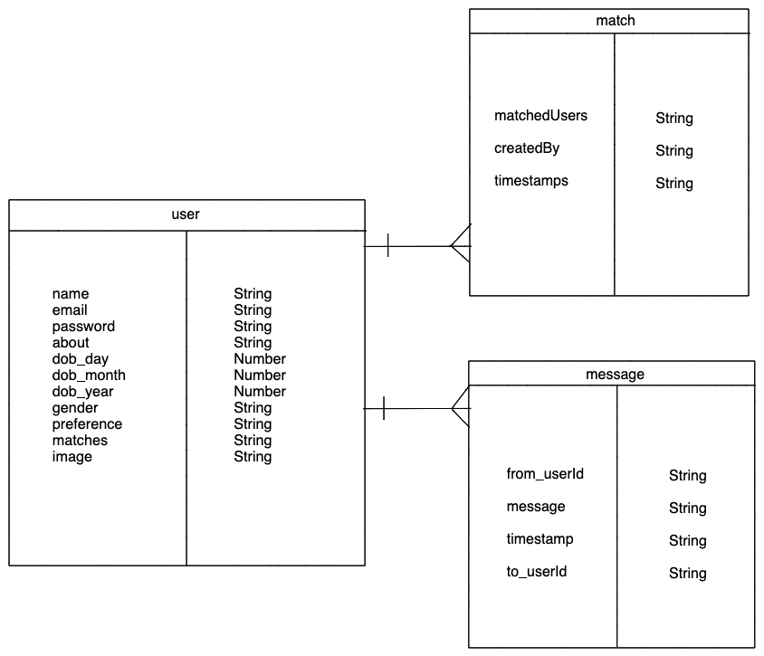
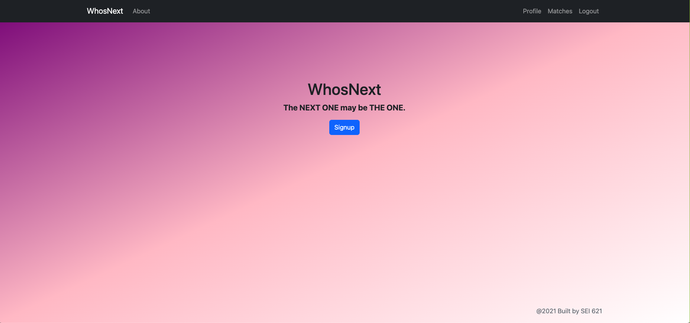

# Who's Next!

Who's Next! is a dating application that helps users find potential relationships. This app allows users to feel comfortable and safe with its vast diversity and ability to display who they are.

## Users' Stories

* As a user I am able to signup and login.
* As a user I am able to see the list of all preferred users.
* As a user I am able to choose one of them as my match.
* As a user I am able to edit my profile.
* As a user I am able to delete my profile when I don't need it anymore.

## Technologies Used

* MongoDb
* Express
* React
* Node
* JavaScript
* Axios

## Collaborators

Frontend
* Nadia Matos
* Jared Hayes

Backend
* Tsung Yen Wu
* Raymond Lee

## Wireframe



## ERD



## Database Set Up

```js
mongoose.connect(MONGO_CONNECTION_STRING, { useNewUrlParser: true, useUnifiedTopology: true });
const db = mongoose.connection;

db.once('open', () => {
    console.log(`Connected to MongoDB at HOST: ${db.host} and PORT: ${db.port}`);
});

db.on('error', (error) => {
    console.log(`Database Error: ${error}`);
})
```
## Homepage Interface



## Deployed Here

https://whonext-app-server.herokuapp.com/